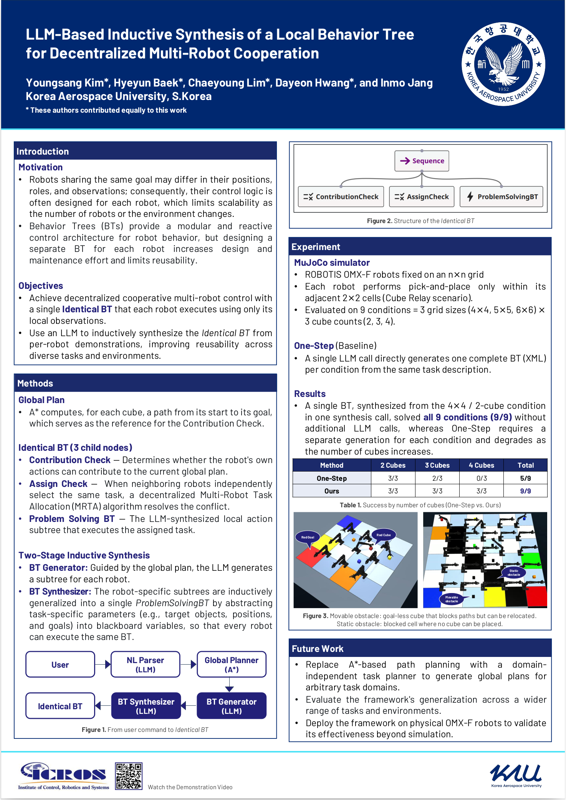

# ICROS2026

## LLM-Based Inductive Synthesis of a Local Behavior Tree for Decentralized Multi-Robot Cooperation

### Project Page

[Open Project Website](https://boss123516.github.io/ICROS2026/)

---

## Poster

